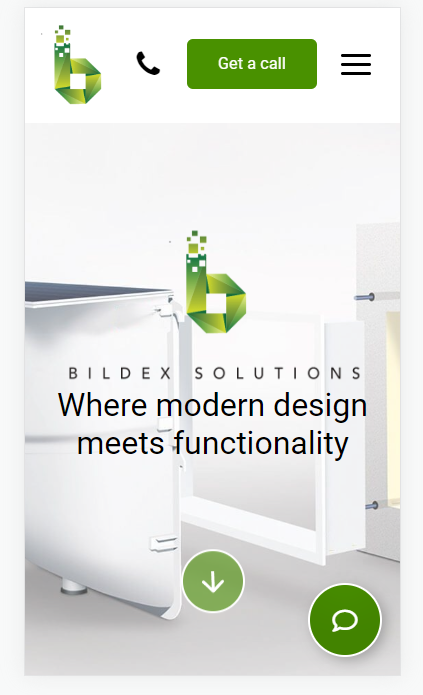
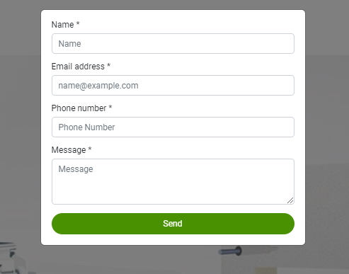

# Buildex solutions (real order)

[Here you can check it](https://artemuholkov.github.io/bildexsolutions/)

---

I didn't have figma design for this project.
It was first real order from Canada.
This landing page is 100% responsive for all types of screens.
I used HTML, CSS, JS in this project.

---

### What was interesting in this project:

1. 3\4 mobile menu with fading background



2. Modal window with form, which sends data to owners e-mail



```
 <form action="https://postmail.invotes.com/send" method="post" id="email_form">
```

4. All sections appear on scroll down

---
